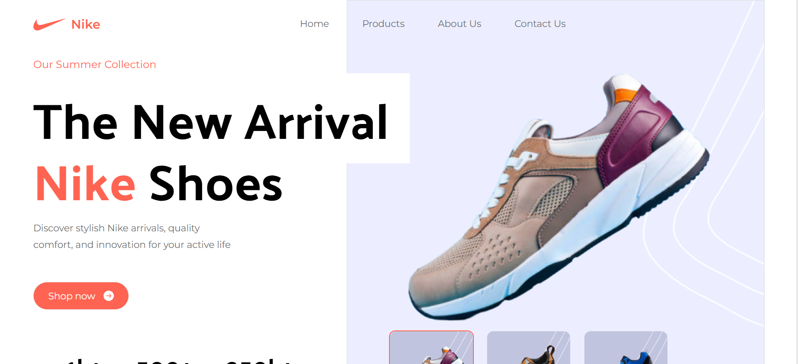

# 🏀 Nike Landing Page  

A **modern, responsive Nike landing page** built with **React** + **Tailwind CSS**.  
This project focuses on clean UI, responsiveness, and Nike-inspired branding.  

---

## 📸 Preview  

---

## ✨ Features  
✅ Built with **React + Vite**  
✅ Styled using **Tailwind CSS**  
✅ Fully **responsive** (mobile-first)  
✅ Smooth scroll & minimalistic UI  
✅ Custom Google Fonts (**Montserrat**, **Palanquin**)  

---

## 🛠️ Tech Stack  
- ⚛️ [React](https://react.dev/) – UI library  
- 🎨 [Tailwind CSS](https://tailwindcss.com/) – styling  
- ⚡ [Vite](https://vitejs.dev/) – dev build tool  
- 🔠 [Google Fonts](https://fonts.google.com/) – Montserrat & Palanquin  

---

